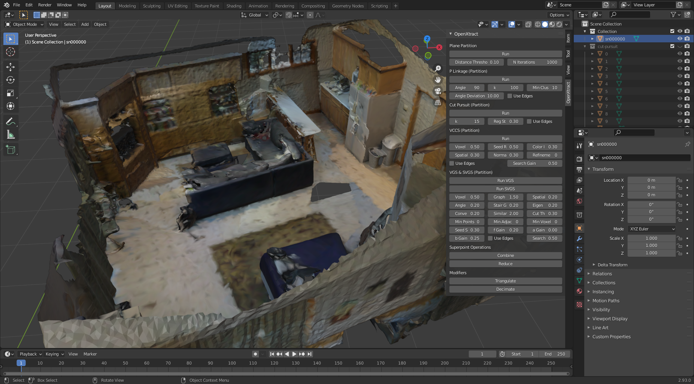
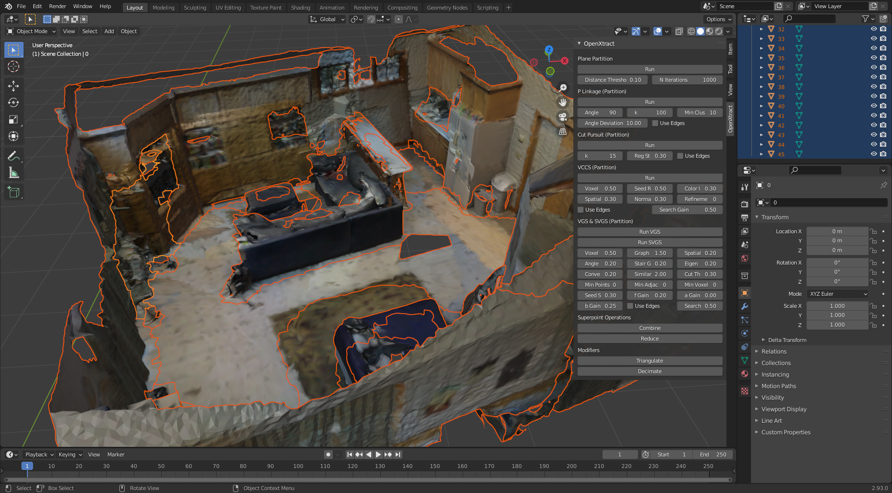

# OpenXtract

Reconstructed mesh of a living room scene.
<a href="https://youtu.be/vklkLWeQSwg">

</a>
    
Partition of the Cut-Pursuit algorithm.
<a href="https://youtu.be/vklkLWeQSwg">

</a>

OpenXtract is a Blender add-on that allows to extract the object of interest by applying partition algorithms. Furthermore, one can also use the PointNet++ semantic segmentation. A short demonstration can be seen on [YouTube](https://youtu.be/vklkLWeQSwg), and a [quickstart video](https://youtu.be/BAB7zqLc2gc) is also available.

## Downloads

We offer OpenXtract in combination with Blender, where one only must download the program to try OpenXtract. After the download, makse sure that OpenXtract is enabled as add-on. Click on Edit->Preferences, Add-Ons and search for OpenXtract. Activate the checkbox if it is disabled.  

### Windows

* [Blender 2.93 with OpenXtract with PyTorch and Cuda](https://nextcloud.mirevi.medien.hs-duesseldorf.de/s/HcNYY4P7Ybyp6Rw): Cuda 11 capable graphics card required. 
* [Blender 2.93 with OpenXtract without PyTorch](https://nextcloud.mirevi.medien.hs-duesseldorf.de/s/TtQ2ky6MWPPgE3m): Does not require any specfic hardware. 

### Linux

* [Blender 2.93 with OpenXtract without PyTorch](https://nextcloud.mirevi.medien.hs-duesseldorf.de/s/zkBKppRZjAM8GiC): Does not require any specfic hardware. 

### MacOs

* Coming Soon.

## Manual Installation with Miniconda

1. Install [miniconda](https://docs.conda.io/en/latest/miniconda.html) and create an environment with a python version that matches your blender python interpreter.
2. Install the dependencies with pip:
```
pip install -r requirements.txt
```
3. Optional: Install [PyTorch](https://pytorch.org) to enable the semantic segmentation functionality. Thanks to yanx27 et al. for creating and maintaining the [PointNet++ repository](https://github.com/yanx27/Pointnet_Pointnet2_pytorch)
4. Compile the partition algorithms in [https://github.com/mati3230/3DPartitionAlgorithms](https://github.com/mati3230/3DPartitionAlgorithms) and copy the resulting dynamic libraries into this project.
4. Zip this folder (not only the contents).
5. Import the add-on in blender by importing the zip file. 

## Citation

```
@inproceedings{Tiator2022,
   author = {Marcel Tiator and Calvin Huhn and Christian Geiger and Paul Grimm},
   city = {Virtual Event},
   journal = {Proceedings of the 5th International Conference on Artificial Intelligence and Virtual Reality - AIVR '22},
   publisher = {IEEE},
   title = {OpenXtract: A Blender Add-On for the Accelerated Extraction of the Objects of Interest},
   year = {2022},
}
```

## Acknowledgements

This project is sponsored by: German Federal Ministry of Education and Research (BMBF) under the project number 13FH022IX6. Project name: Interactive body-near production technology 4.0 (German: Interaktive körpernahe Produktionstechnik 4.0 (iKPT4.0))


